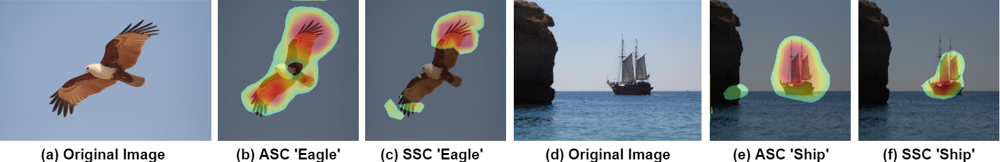
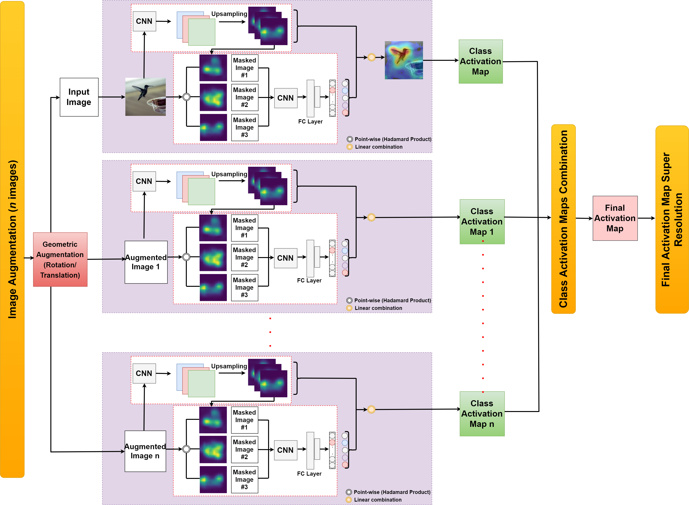

# Augmented Score-CAM: High resolution visual interpretations for deep neural networks

We develop a novel post-hoc visual explanation method called Augmented Score-CAM that improves Score-CAM activation maps by applying image augmentation based on the matrix computation techniques [[1]](#1), Score-CAM [[2]](#2), and Augmented Grad-CAM [[3]](#3). In our experiments, we denote our model as ASC and Score-CAM as SSC.

The following is the pipeline of our method:

Paper: [Augmented Score-CAM: High resolution visual interpretations for
deep neural networks](https://doi.org/10.1016/j.knosys.2022.109287) published at: [Elsevier Knowledge Based Systems](https://www.journals.elsevier.com/knowledge-based-systems)

## Demo
You can run an example via [Google Colab](https://drive.google.com/file/d/1rXqetQkS1JALNmkDOkOfZzR8CLXxVruj/view?usp=sharing)
## Citation
If you find the code useful for your research, please cite our work:

@article{IBRAHIM2022109287,
title = {Augmented Score-CAM: High resolution visual interpretations for deep neural networks},
journal = {Knowledge-Based Systems},
volume = {252},
pages = {109287},
year = {2022},
issn = {0950-7051},
doi = {https://doi.org/10.1016/j.knosys.2022.109287},
url = {https://www.sciencedirect.com/science/article/pii/S0950705122006451},
author = {Rami Ibrahim and M. Omair Shafiq},
keywords = {Explainable AI, Class activation maps, Augmented Score-CAM}
## Contact
If you have any questions, feel free to contact me at: ramif.ibrahim@carleton.ca
## References
<a id="1">[1]</a> 
AIR Galarza, J Seade (2007). 
Introduction to classical geometries. 
Springer Science & Business Media.

<a id="2">[2]</a> 
Wang, Haofan, et al. (2020). 
Score-CAM: Score-weighted visual explanations for convolutional neural networks. 
Proceedings of the IEEE/CVF conference on computer vision and pattern recognition workshops (pp. 24-25).

<a id="3">[3]</a> 
Morbidelli, Pietro, et al. (2020). 
Augmented Grad-CAM: Heat-maps super resolution through augmentation. 
ICASSP 2020-2020 IEEE International Conference on Acoustics, Speech and Signal Processing (ICASSP) (pp. 4067-4071).
